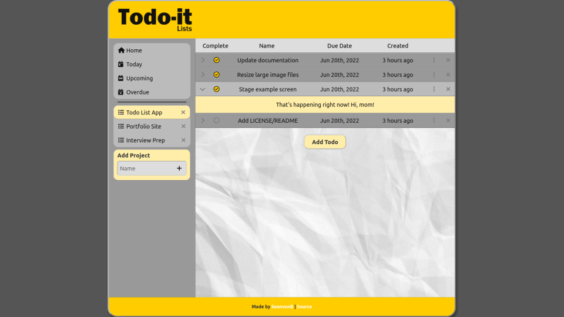

# Todo List

[LIVE PREVIEW](https://seanvonb.github.io/todo-list/)

An app for managing todo lists seems like a webdev rite of passage, so I felt obliged to make my own. However, I also used this as an opportunity to round up several concepts and conventions that I hadn't already demonstrated, like using ES6 modules with Node and a bundler ([webpack](https://webpack.js.org/)), using a CSS preprocessor ([Sass](https://sass-lang.com/)), coordinating dependencies, preferring CSS Grid over Flexbox, and following an object pattern. Rather than use classes, I used factory modules, and I did my best to avoid using `new` and `this` throughout the build – just to see what that's like.

## Features

-   Create and update locally-saved todo lists and projects
-   Add, edit, and delete individual todos and their respective details
-   Sort todos by completion, name, and/or due date
-   Do all of the above on desktop or mobile

## Security

This web application currently uses [localStorage](https://developer.mozilla.org/en-US/docs/Web/API/Window/localStorage) to save your todos on your machine as a JSON string, which generally isn't a safe practice, as localStorage is accessible to any JavaScript running on the domain. I don't know why you would trust this app with your credit card or SSN in the first place; but, while your todo lists are intended to be private, please don't assume they are secure.

## Credits

-   This project was recommended by [The Odin Project](https://www.theodinproject.com/).
-   Icons are provided by [Font Awesome](https://fontawesome.com/).

## License

Copyright © 2022 Sean von Bayern  
Licensed under the [MIT License](LICENSE.md)
